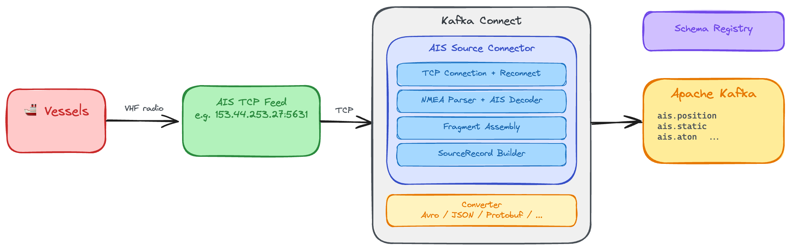

= Kafka Connect AIS Source Connector

image:https://github.com/rmoff/kafka-connect-ais/actions/workflows/build.yml/badge.svg[Build]

NOTE: This is a proof of concept, built to explore using Claude Code to write a Kafka Connect connector from scratch. The connector has not been tested beyond the basic quickstart below. Use at your own risk.

A Kafka Connect source connector that ingests live https://en.wikipedia.org/wiki/Automatic_identification_system[AIS] (Automatic Identification System) maritime data from TCP endpoints and produces structured records to Kafka.

It handles TCP connection management, NMEA sentence parsing, multi-sentence fragment assembly, and AIS message decoding natively.

== Architecture

== What it does

* Connects to AIS TCP data feeds (e.g., the Norwegian Coastal Administration's live feed at `153.44.253.27:5631`)
* Decodes all 28 AIS message types into structured fields (position, vessel identity, base station reports, aids to navigation, safety messages, etc.)
* Keys records by MMSI (vessel identifier) for natural partitioning
* Reconnects automatically with exponential backoff when the TCP connection drops
* Optionally routes messages to per-type topics (`.position`, `.static`, `.base_station`, etc.)

== Quickstart

Runs the connector locally against Kafka in Docker, using the pre-built release --- no build required. (To run it on Confluent Cloud instead, see <<deploy-confluent-cloud>>.)

You'll need Docker, https://github.com/kcctl/kcctl[kcctl], and the https://cli.github.com/[GitHub CLI] (`gh`) --- or grab the `.zip` from the https://github.com/rmoff/kafka-connect-ais/releases[Releases page] by hand.

Download the latest released connector into `./plugins/`:

[source,bash]
----
mkdir -p plugins
gh release download --repo rmoff/kafka-connect-ais --pattern '*.zip' --dir plugins
unzip -o plugins/*.zip -d plugins
----

Start Kafka, Schema Registry, and Kafka Connect (the connector is mounted from `./plugins/`):

[source,bash]
----
docker compose up -d
----

Point kcctl at the Connect worker:

[source,bash]
----
kcctl config set-context --cluster=http://localhost:8083 local
----

Wait for Connect to be ready, then check that the plugin is loaded:

[source,bash]
----
kcctl get plugins
----

You should see `net.rmoff.connect.ais.AisSourceConnector` in the list.

Create the connector:

[source,bash]
----
kcctl apply -f configs/connector-ais.json
----

Check it's running:

[source,bash]
----
kcctl describe connector ais-source
----

Consume some records with https://github.com/edenhill/kcat[kcat]:

[source,bash]
----
kcat -b localhost:9092 -t ais -C -s value=avro -r http://localhost:8081 -c 5 | jq '.'
----

Or use the console consumer from the Schema Registry container:

[source,bash]
----
docker exec schema-registry kafka-avro-console-consumer \
  --bootstrap-server broker:29092 \
  --topic ais \
  --from-beginning \
  --max-messages 5 \
  --property schema.registry.url=http://localhost:8081
----

Shut it all down:

[source,bash]
----
kcctl delete connector ais-source
docker compose down
----

=== Per-type topics

Instead of a single topic, you can split messages into separate topics by category. Use `configs/connector-ais-per-type.json`:

[source,bash]
----
kcctl apply -f configs/connector-ais-per-type.json
----

This produces records on separate topics:

* `ais.position` -- vessel position reports (types 1, 2, 3, 9, 18, 19, 27)
* `ais.static` -- vessel identity and voyage data (types 5, 24)
* `ais.base_station` -- base station reports (types 4, 11)
* `ais.aton` -- aids to navigation (type 21)
* `ais.safety` -- safety messages (types 12, 14)
* `ais.binary` -- application-specific binary (types 6, 8, 25, 26)
* `ais.other` -- control/management (everything else)

NOTE: The connector does **not** create these topics. On a cluster with auto-create enabled (the default in the bundled `docker-compose.yml`) they'll appear on first write, but on clusters where auto-create is off -- including all Confluent Cloud clusters -- you have to create each per-type topic up front, otherwise the producer will fail with `UNKNOWN_TOPIC_OR_PARTITION`.

=== Working with the data

Show live vessel positions:

[source,bash]
----
kcat -b localhost:9092 -t ais.position -C -s value=avro -r http://localhost:8081 -u | \
  jq -r '"\(.mmsi)  \(.latitude.double)  \(.longitude.double)  sog=\(.speed_over_ground.double)  \(.nav_status_text.string // "")"'
----

....
258006890  70.286049  23.470331  sog=0.0    Moored
257125290  66.395016  12.77815   sog=23.5   Under way using engine
259225000  69.63761   18.003028  sog=0.1    Engaged in fishing
257733500  62.340093  5.689755   sog=0.0    Under way sailing
....

Show vessel names and destinations:

[source,bash]
----
kcat -b localhost:9092 -t ais.static -C -s value=avro -r http://localhost:8081 -u | \
  jq -r '"\(.mmsi)  \(.ship_name.string // "-")  \(.ship_type_text.string // "-")  dest=\(.destination.string // "-")"'
----

....
257073700  STOLMASUND    Cargo                   dest=CH 16
257062790  TAIFUN        HSC                     dest=SALMAR TEKNISK
259027590  FROY MASTER   Dredging/underwater ops  dest=FISHFARMS
257275800  BJORNFJELL    Port tender             dest=NONVK
....

Show aids to navigation:

[source,bash]
----
kcat -b localhost:9092 -t ais.aton -C -s value=avro -r http://localhost:8081 -u | \
  jq -r '"\(.mmsi)  \(.aid_name.string // "-")  \(.latitude.double)  \(.longitude.double)  virtual=\(.virtual_aid.boolean)"'
----

....
992651014  V 10        58.399653  12.320668  virtual=true
992576420  TETRA SPAR  59.150701  5.013845   virtual=true
....

Check the registered Avro schemas:

[source,bash]
----
curl -s http://localhost:8081/subjects | jq .
----

[#deploy-confluent-cloud]
== Deploy as a Custom Connector on Confluent Cloud

The connector runs as a https://docs.confluent.io/cloud/current/connectors/bring-your-connector/overview.html#install-custom-connectors-for-ccloud[Custom Connector for Confluent Cloud]. The flow is: get the component archive, upload it as a plugin, then create the connector against your CC cluster.

You'll need the https://docs.confluent.io/confluent-cli/current/overview.html[`confluent` CLI] logged into your environment.

Get the component archive. Either download a published release (no build needed):

[source,bash]
----
# latest release, into the current directory
gh release download --repo rmoff/kafka-connect-ais --pattern '*.zip'
----

...or build it from source:

[source,bash]
----
mvn clean package -DskipTests
# -> target/components/packages/rmoff-kafka-connect-ais-<version>.zip
----

Upload as a CC Custom Connector plugin (returns a `ccp-XXXXXX` plugin ID, keep it). Use the component **`.zip`** --- it carries the connector and its dependencies plus a `manifest.json`:

[source,bash]
----
confluent connect custom-plugin create kafka-connect-ais \
  --plugin-file rmoff-kafka-connect-ais-0.2.2.zip \
  --connector-class net.rmoff.connect.ais.AisSourceConnector \
  --connector-type source \
  --cloud aws
----

Pre-create the destination Kafka topic (CC Standard clusters do not auto-create):

[source,bash]
----
confluent kafka topic create ais --partitions 6 \
  --cluster <lkc-...> --environment <env-...>
----

If you're using the per-type variant (`configs/confluent-cloud/connector-ais-per-type.json`), pre-create **all** of them up front -- the connector will not create them itself:

[source,bash]
----
for t in ais.position ais.static ais.base_station ais.aton \
         ais.safety ais.binary ais.other; do
  confluent kafka topic create "$t" --partitions 6 \
    --cluster <lkc-...> --environment <env-...>
done
----

Edit `configs/confluent-cloud/connector-ais.json` (provided in this repo) and fill in the placeholders:

* `confluent.custom.plugin.id` -- the `ccp-XXXXXX` from the upload step
* `confluent.custom.connection.endpoints` -- the AIS source endpoint (see "Egress" below)
* `kafka.api.key` / `kafka.api.secret` -- a CC Kafka API key/secret for the target cluster

The Schema Registry URL, credentials, and SR egress are all injected automatically by `confluent.custom.schema.registry.auto=true` -- see "Schema Registry" below.

Create the connector:

[source,bash]
----
confluent connect cluster create \
  --config-file configs/confluent-cloud/connector-ais.json \
  --cluster <lkc-...> --environment <env-...>
----

=== Custom Connector-specific config fields you will not guess

These are required for any Custom Connector and have no equivalent in self-managed Kafka Connect, so they're not in the `Configuration` table further down. The `configs/confluent-cloud/connector-ais.json` template includes them all:

* `confluent.connector.type=CUSTOM` -- marks this as a Custom Connector deployment
* `confluent.custom.plugin.id=<ccp-XXXXXX>` -- the plugin ID returned by `confluent connect custom-plugin create`
* `confluent.custom.connection.endpoints=<host:port:PROTO>;...` -- egress allowlist (see next section)

=== Egress: only the AIS source endpoint

A Custom Connector for Confluent Cloud runs in a sandbox with no outbound network access by default. Every host it needs to reach must appear in `confluent.custom.connection.endpoints`.

For this connector, that's just the AIS source:

[source]
----
confluent.custom.connection.endpoints=153.44.253.27:5631:TCP
----

The Schema Registry egress is added to the allowlist for you by `confluent.custom.schema.registry.auto=true` (see next section) -- you do **not** need to list the `psrc-...` FQDN here.

CC docs say egress endpoints must be FQDN, but for the Norwegian Coastal Administration's AIS feed only an IP literal is published (no PTR / forward DNS). The IP literal **is** accepted by the CC control plane and the egress is honored.

=== Schema Registry: let `schema.registry.auto` wire it up (lowercase `true`)

The default value path of this connector is Avro to a Schema Registry. The shipped template uses Confluent Cloud's auto-mode:

[source]
----
confluent.custom.schema.registry.auto=true
value.converter=io.confluent.connect.avro.AvroConverter
----

The platform injects the SR URL, credentials, and SR egress allowlist entry for you. Do **not** also set `value.converter.schema.registry.url`, `value.converter.basic.auth.credentials.source`, or `value.converter.basic.auth.user.info` -- auto-mode rejects them with `Unsupported connector config(s) with schema registry auto mode enabled`.

CAUTION: The value is **case-sensitive**. Use lowercase `"true"`. `"TRUE"` (which is what some Confluent docs examples show) is silently ignored -- the connector reaches RUNNING but fails on startup with `ConfigException: Missing required configuration "schema.registry.url"` because no SR config gets injected.

If you'd rather wire SR manually (e.g. to use a non-default SR API key), omit `confluent.custom.schema.registry.auto` and set all four fields yourself, **and** add the SR FQDN to `confluent.custom.connection.endpoints`:

[source]
----
confluent.custom.connection.endpoints=\
  153.44.253.27:5631:TCP;\
  <psrc-XXXXXX>.<region>.<cloud>.confluent.cloud:443:TCP

value.converter=io.confluent.connect.avro.AvroConverter
value.converter.schema.registry.url=https://<psrc-XXXXXX>.<region>.<cloud>.confluent.cloud
value.converter.basic.auth.credentials.source=USER_INFO
value.converter.basic.auth.user.info=<SR_KEY>:<SR_SECRET>
----

If you don't want Avro/SR at all, swap the value converter and drop the SR config:

[source]
----
value.converter=org.apache.kafka.connect.json.JsonConverter
value.converter.schemas.enable=false
----

=== Debugging failed deploys: read the app-logs topic

The user-facing failure surface of a Custom Connector is minimal -- `confluent connect cluster list` will show `FAILED` with a generic "review the connector's common logs in the Kafka topic `clcc-XXXXXX-app-logs` to debug the issue" message. That topic is the only useful signal.

To see what actually went wrong, consume from `<connector-id>-app-logs` (it's created in your own cluster, on first connector launch) and filter by `level=ERROR`. The interesting payload is usually in the structured `exception.stacktrace` field of the log JSON, not the `message` field. Example with kcat:

[source,bash]
----
kcat -b <bootstrap> -X security.protocol=SASL_SSL \
     -X sasl.mechanisms=PLAIN \
     -X sasl.username=<key> -X sasl.password=<secret> \
     -t clcc-XXXXXX-app-logs -C -o end -q | \
  jq -r 'select(.level=="ERROR") | "\(.timestamp)\n\(.message)\n\(.exception.stacktrace // "")\n---"'
----

== Configuration

[cols="1,1,1,3"]
|===
|Property |Type |Default |Description

|`ais.hosts`
|STRING
|_(required)_
|Comma-separated `host:port` pairs for AIS TCP endpoints

|`topic`
|STRING
|_(required)_
|Kafka topic name (or topic prefix when `topic.per.type=true`)

|`topic.per.type`
|BOOLEAN
|`false`
|Route messages to per-type topics: `<topic>.position`, `<topic>.static`, `<topic>.base_station`, `<topic>.safety`, `<topic>.aton`, `<topic>.binary`, `<topic>.other`

|`poll.timeout.ms`
|LONG
|`100`
|Max ms to spend reading per `poll()` call

|`batch.max.size`
|INT
|`500`
|Max records per `poll()` batch

|`reconnect.backoff.initial.ms`
|LONG
|`1000`
|Initial reconnect delay

|`reconnect.backoff.max.ms`
|LONG
|`60000`
|Max reconnect delay (doubles each failure)

|`fragment.timeout.ms`
|LONG
|`30000`
|Timeout for incomplete multi-sentence messages

|`tcp.connect.timeout.ms`
|INT
|`10000`
|TCP connect timeout in milliseconds.

|`tcp.socket.timeout.ms`
|INT
|`1000`
|Socket read timeout (SO_TIMEOUT) in ms; bounds how long a single poll() read blocks.

|`idle.timeout.ms`
|LONG
|`60000`
|Force a reconnect if no data has been received from the feed for this many ms. Guards against silently half-open TCP connections that the OS still reports as connected. Set to `0` to disable.

|`no.data.log.interval.ms`
|LONG
|`30000`
|While connected but receiving no data, log an INFO heartbeat at most this often (ms) so a starved/silent feed connection is visible in the logs. Set to `0` to disable.

|`metrics.log.interval.ms`
|LONG
|`60000`
|Emit a one-line INFO metrics summary at most this often (ms). `0` disables. Primary observability surface where JMX is unavailable (e.g. Confluent Cloud Custom Connectors).

|`decode.common.only`
|BOOLEAN
|`true`
|When true, only the most useful message types get full field decoding (position, identity, base station, safety, AtoN). Binary/control types get common fields + `raw_nmea` only.
|===

=== Observability

Each task emits a one-line INFO metrics summary to the log every `metrics.log.interval.ms` (default 60 s). The line reports cumulative counters since the task started:

----
AIS task metrics: emitted=1234 decodeErrors=0 incompleteFragments=5 unsupportedTypes=12 reconnects=1 fragmentBuffer=0 uptimeMs=123456
----

Counters:

* `emitted` -- records successfully parsed and sent to Kafka
* `decodeErrors` -- NMEA sentences that could not be decoded
* `incompleteFragments` -- multi-sentence fragments not yet fully assembled
* `unsupportedTypes` -- AIS message types not recognised by the decoder
* `reconnects` -- number of TCP reconnections since the task started
* `fragmentBuffer` -- incomplete fragments currently held in memory
* `uptimeMs` -- milliseconds since the current TCP connection epoch

On self-managed Kafka Connect workers with JMX enabled, the same counters are also exposed via JMX at ObjectName `net.rmoff.connect.ais:type=TaskMetrics,host=<host>,port=<port>`. The log heartbeat is the primary observability surface on runtimes without JMX access (e.g. Confluent Cloud Custom Connectors).

Set `metrics.log.interval.ms=0` to disable the log heartbeat entirely.

== Output schema

Every record includes these common fields:

* `mmsi` (INT32) -- vessel identifier, also used as the record key
* `msg_type` (INT32) -- AIS message type number
* `receive_timestamp` (INT64) -- milliseconds since epoch from the tag block
* `source_station` (STRING) -- receiving station ID from the tag block
* `raw_nmea` (STRING) -- the original NMEA sentence(s), always present

Position reports (types 1, 2, 3, 18, 19, 27) add: `latitude`, `longitude`, `speed_over_ground`, `course_over_ground`, `true_heading`, `nav_status`, `nav_status_text`, `rate_of_turn`, `timestamp_second`.

Static/voyage data (types 5, 24) adds: `imo_number`, `callsign`, `ship_name`, `ship_type`, `ship_type_text`, `dimension_to_bow/stern/port/starboard`, `draught`, `destination`, `eta`.

See the source for the full field list per message type.

Invalid sentinel values (latitude 91.0, longitude 181.0, heading 511, etc.) are converted to `null`.

The Avro schema is registered automatically in Schema Registry. You can inspect it at http://localhost:8081/subjects/ais-value/versions/latest.

=== Subjects registered in Schema Registry

With the default `TopicNameStrategy`, the subject names follow the topic names:

In single-topic mode (`topic.per.type=false`, default), one subject is registered:

* `ais-value` -- Avro record `net.rmoff.connect.ais.AisValue`, the flat schema containing every field across all message types

In per-type mode (`topic.per.type=true`), one subject per category is registered, each with its own narrower Avro record:

* `ais.position-value` -- `Position`
* `ais.static-value` -- `Static`
* `ais.base_station-value` -- `BaseStation`
* `ais.safety-value` -- `Safety`
* `ais.aton-value` -- `AtoN`
* `ais.binary-value` -- `Binary`
* `ais.other-value` -- `Other`

(Replace `ais` with whatever prefix you've set in the `topic` config.)

Records also have a key (the INT32 MMSI). Whether a `*-key` subject is registered depends on which key converter your worker / connector config uses: the local `docker-compose.yml` here configures `AvroConverter` for keys (so you'll also see `ais-key` etc.), whereas the supplied Confluent Cloud templates use `StringConverter` for keys (so no key subjects are registered).

== Headers

Every record carries these Kafka headers for routing/filtering without deserialization:

* `ais.msg_type` -- the message type as a string (e.g., `"1"`, `"5"`, `"18"`)
* `ais.source_station` -- the receiving station ID

== AIS data sources

The default endpoint in the quickstart is the Norwegian Coastal Administration's public AIS feed. It streams roughly 15 messages per second of live vessel traffic around the Norwegian coast. No authentication required.

== How it works

This is a TCP stream source connector, which is a bit different from the typical database/API source pattern:

* The TCP connection is opened in `start()` and persists across `poll()` calls
* `poll()` reads whatever's buffered on the socket, parses NMEA sentences, decodes AIS messages, and returns SourceRecords
* There's no replay -- if the connector is down, messages during downtime are lost. The data source doesn't buffer.
* Reconnection with exponential backoff is the main failure-handling mechanism
* `SO_TIMEOUT` on the socket prevents `poll()` from blocking forever on a stalled connection
* `stop()` closes the socket from a different thread, which unblocks any pending read

The connector declares `ExactlyOnceSupport.UNSUPPORTED`. The upstream AIS TCP feed has no replay -- messages broadcast during a connector outage are simply lost -- so end-to-end exactly-once is impossible regardless of how Connect commits offsets. Each task does track a `{connection_epoch, message_count}` offset per host, but this is for monitoring rather than replay: the offset cannot be used to resume the stream where it left off.

AIS message decoding is handled by https://github.com/dma-ais/AisLib[AisLib] from the Danish Maritime Authority.

== Building

Requires Java 11+ and Maven.

[source,bash]
----
mvn clean package
----

The build produces two usable artifacts (where `<version>` matches the project version, e.g. `0.2.2`):

* `target/components/packages/rmoff-kafka-connect-ais-<version>.zip` -- a Confluent component archive with a `manifest.json` (produced by the `kafka-connect-maven-plugin`). This is the canonical https://www.confluent.io/hub/[Confluent Hub] / Marketplace format, it's what each GitHub release ships, and it's the recommended `--plugin-file` for `confluent connect custom-plugin create` (it bundles the connector + its dependencies).
* `target/kafka-connect-ais-<version>.jar` -- the shaded fat JAR. Drop it into a self-managed Connect worker's `plugin.path` directory.

To try a local build with the Docker quickstart, unpack the component archive into `./plugins/` (where `docker-compose.yml` mounts it) instead of downloading a release:

[source,bash]
----
mkdir -p plugins && unzip -o target/components/packages/*.zip -d plugins
docker compose up -d
----

== Credits

Directed by @rmoff, built with https://claude.ai/[Claude Code] using the `kafka-connect` Claude Code skill from @rmoff.

AIS message decoding by https://github.com/dma-ais/AisLib[AisLib] (Danish Maritime Authority, Apache 2.0 license).
